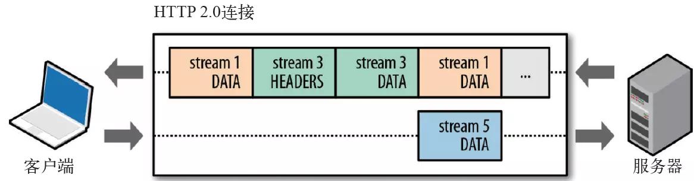
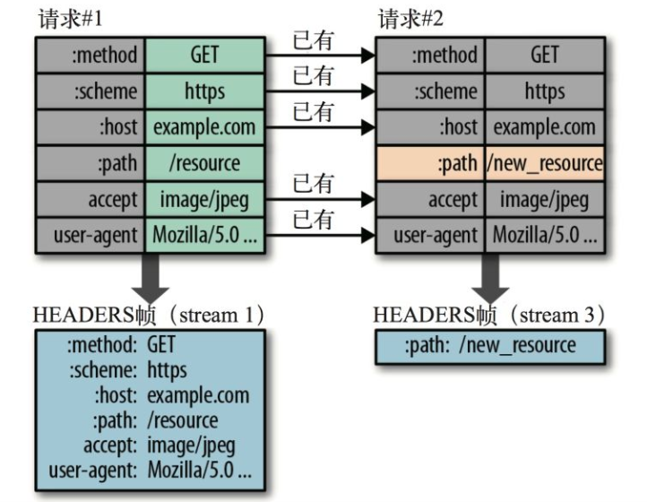

# HTTP 先导知识

## HTTP 长连接、短连接

首先需要明确的是，`HTTP`是处于应用层的`网络协议`，而`长连接`是存在于`网络层`是一种**连接状态**。而实现它需要在传输层进行开发，因为它是基于对真实数据的收发，需要在底层进行管控。

那问题来了，作为应用层的`HTTP`协议如何能实现长连接呢？

`HTTP`作为应用层协议，它的生命周期在`Server`返回响应的时候就已经结束了，而所谓支持长连接只是说基于`Keep-Alive`请求头所约定，从而向下进行长连接发起的一种机制，它仍然是基于`TCP`的。

即所谓`HTTP1.1+`支持长连接，并不是`HTTP1.1`可以建立长连接，而是它支持以请求头`Keep-Alive`的方式进行长连接的发起，并且要求`client`和`Server`都要具备`Keep-Alive: true`。

它的效果就是，在一定时间内，多个`http`请求可以不重复创建`TCP`连接，而使用一个`TCP`。

### 带宽

带宽在通信系统中有不同的含义。对于模拟通信系统，带宽包括两个概念：`信道带宽`和`信号传输带宽`，单位是`赫兹`。

- 信道带宽：是信道的固有属性，只与信道介质有关，是介质的物理属性。数值上等于信道中能通过模拟信号的`最高频率`和`最低频率`的差值。
- 信号带宽：是某种通信业务信号频率的`最高分量`和`最低分量`之间的差值

> 对于数字通信系统，特别是计算机网络当中，网络的带宽通常用来表示通信线路所能够传输数据的能力，是数字信道所能传输的最高数据率，单位是`bit/s`。简单理解带宽就是网速吧。。。

### 短连接

短连接就是连接只保持在数据传输的过程，请求发起=>连接建立=>数据返回=>连接关闭。

> 它适用于实时数据的请求，配以轮询来进行新旧数据的更替。

### 长连接

长连接是在请求发起~请求关闭`client`和`Server`都保持连接，实质上是保持这个通信管道，之后便可以对其进行复用。减少了建立连接和关闭连接的消耗与延迟。也就是多个`HTTP`请求是基于同一个`TCP`的连接的。

注意：`Keep-Alive`不会永久保持连接，有一个保持时间，可以在不同的服务器软件中设定这个时间。

> 它适用于消息推送、请求频繁的场景。在连接建立以后，在该连接下的所有请求都可以重用这个长连接管道，避免了频繁的连接请求，提升了效率。

## 长轮询、短轮询

轮询就是在一个循环周期内不断发起请求来得到数据的机制。只要有请求的地方，都可以实现轮询，它的长短在与某次请求的返回周期。

### 短轮询

短轮询是指在循环周期内，不断地发起请求，每一次都立即返回结果，根据新旧数据的对比来决定是否使用此结果。

### 长轮询

长轮询是在请求过程中，如果服务器数据没有更新，则不反回结果，将此连接挂起。直到服务器推送新的数据，再返回，然后再次进入循环周期。

> 长轮询、短轮询的理想实现应该都基于长连接，否则如果循环周期太短，服务器的载荷会过重。不过就算是在长连接下，访问数目过多也会对服务器造成瞬时访问，这时就需要一些优化了。

## 流水线

- 非流水线方式：`client`在收到上一个请求的响应之后才能发送下一个请求。
- 流水线方式：`client`可以不必等待上一个请求的响应返回就直接发送后续请求。

> 非流水线发送完一个请求之后，需要等待一个`RTT`，这个时候`TCP`处于空闲状态，浪费`server`资源。

# HTTP1.0 与 1.1 的区别

## 一、持久连接和流水线

在`HTTP1.0`中，每次请求都要建立新连接。
而`HTTP1.1`默认启用长连接，也就是同一个`TCP`中可以传送多个`HTTP`请求和响应，多个请求和响应可以重叠，多个请求和响应可以同时进行。

> `HTTP1.1`的持久连接也需要增加新的请求头来帮助实现。

`HTTP1.1`相较于 1.0 新增特点（持久连接方面）

- 默认启用长连接和请求的流水线(`pipelining`)处理，在一个`TCP`连接上可以传送多个`HTTP`（这多个请求可以复用一个`HTTP`请求）请求和响应，减少了建立和关闭连接的消耗和延迟。比如：处于同一域名下的网页和图片可以使用同一个`TCP`连接来传输，不过单个的网页文件仍然是需要使用各自的连接。
- 允许`client`不用等待上次请求的响应返回就发出下一次请求。不过服务器必须按照`client`请求的先后顺序来依次返回响应结果(这是为了保证`client`能够区分每次响应的内容)，显著的减少了整个下载过程需要的时间。

> 在请求头中包含`Connection:Keep-Alive`头部，如果`Server`愿意维持这条连接，那么在响应头部也包含`Connetion:Keep-Alive`头部，与此同时可以加入一些描述该长连接的属性，如：`max、timeout`等。当头部为`Connection:close`时，连接关闭。

## 二、Host 域

因为`HTTP1.0`中认为每个服务器都只有对应的一个`IP地址`，所以`URL`中没有传递主机名，但是随着虚拟主机技术的发展，一台物理服务器可以有多个具有独立域名的虚拟主机（一个`ip`多个域名，不同域名的服务不同），他们共享一个`IP`地址。这个时候`HTTP1.1`新增头部`host`，`client`指定自己想要访问的`HTTP`服务的`域名/IP地址`跟`端口号`。

根据不同的`host`值，转发到不同的`upstream`服务节点，它常用语虚拟主机服务业务。

> 在`HTTP1.1`中不能缺失`host`字段，否则会`400 bad request`，但是可以是空值。`HTTP1.0`可以缺少`host`字段。不过大部分的服务器比较仁慈，就算没有也会默认给你加上。

## 三、缓存处理

在`HTTP1.0`中主要使用`header`里面的`If-Modified-Since`, `Expires`来作为缓存判断的标准，`HTTP1.1`则引入了更多对缓存控制策略： `ETag(Entity tag)`、`If-Unmodified-Since`、`If-Match`、`If-None-Match`、`Cache-Control`等更多的缓存头来控制缓存策略。

> `If-Unmodified-Since`和`If-Modified-Since`意义相反，区别是当`Server`资源条件不满足时，不是返回 304，而是`412 Precondition Failed`，表示`client`错误，对目标资源的访问请求被拒绝。这通常发生于采用除 GET 和 HEAD 之外的方法进行条件请求时，由首部字段 `If-Unmodified-Since` 或 `If-None-Match` 规定的先决条件不成立的情况下。这时候，请求的操作——通常是上传或修改文件——无法执行，从而返回该错误状态码。

[关于 HTTP 缓存的具体知识](./cache.md)

## 四、新增请求方法(Request Method)

HTTP1.1 新增方法：

- OPTIONS
- DELETE
- PUT
- TRACE
- CONNECTT

## 五、Range 和 Content-Range（节约优化）

`HTTP1.0`中，如果只需要某个资源的一部分，而服务器将整个资源都传递过来，会存在一定的带宽浪费。所以`HTTP1.1`新增`range`头部，它允许请求资源的某个部分，`Content-Range`生命了返回的这部分对象的偏移值和长度，响应码是`206(partial Conent)`，防止缓存将响应误以为是一个完整的资源。

节约资源的一个非常有效的方法是将数据压缩传输，`Content-Encoding`是对消息进行端到端的编码，在请求中加入`Accept-Encoding`告诉服务器客户端能够解码的编码方式。

```http
<!-- 当前压缩格式 -->
Content-Encoding: gzip
<!-- 能够接受的压缩格式 -->
Accept-Encoding: gzip
```

> 以上的编码对整个传输段都是有效的（server => proxy server => client）。

而`Transfer-Encoding`是逐段式的编码，比如`chunked`编码，在请求中加入`TE`告诉服务器 client 能够接受的编码方式和优先级。

```http
<!-- 当前压缩格式 -->
Transfer-Encoding: gzip
<!-- 能够接受的压缩格式 -->
TE: gzip
```

> 以上的编码仅对两个结点传输段是有效的（server => proxy， proxy => client）。

根本的区别在于`Content-Encoding`限制的是报文主体在**整个传输过程**中使用的编码方式，**全局有效**；
而`Transfer-Encoding`限制的是报文主体在**两个节点之间**的编码方式(原服务器和代理服务器、代理服务器和客户端之间)，只能**节点间有效**。

[详细解释](https://blog.csdn.net/swt369/article/details/77847896)

## 六、100(Continue) status （节约带宽）

某些情况下，请求中包含较大的实体，但是不确定`Server`是否能够接受该请求(权限问题)，如果贸然发出带实体的请求，被拒绝的话就会浪费带宽。

`HTTP1.1`引入`100(Continue)`新状态码。客户端先发送一个只带头部的请求，如果权限不足被`Server`拒绝(`401 Unauthorized`)，反之`Server`响应 100 告诉客户端可以发送带实体的完整请求，此时客户端再发送完整的实体就可以了。客户端在请求头中需要添加`Expect: 100-continue`。

`Expect:100-continue`是用于`client`发送`post`数据时，询问`Server`是否处理此`POST`数据，如果不处理`client`不上传，反之上传。

> 实际使用的时候`post`上传的数据过大时才会用到`100-continue`。

客户端策略：

- 如果`client`有`POST`数据要上传，可以考虑是否使用，如果需要使用则在头部加上`Expect：100-continue`。
- 如果没有`POST`数据，则不应该使用，防止 Server 误解
- 如果用到 Server 没有正确实现此协议则在 timeout 时间内无响应后需要立马上传`post`数据
- 有时候服务器会错误返回 100，但是在不需要此协议的时候客户端应该忽略。

服务器策略：

- 正确情况下返回 100
- 如果在发送 100 响应码的时候已经超时，client 已经发送`post`数据，则 Server 不需要发送 100.
  > HTTP1.0 不支持 100 的状态码。

## 其他

在`HTTP1.1`中新增了 24 个错误状态响应码，如`409（Conflict）`表示请求的资源与资源的当前状态发生冲突；`410（Gone）`表示服务器上的某个资源被永久性的删除。

[更多有关状态码的知识](https://github.com/wb421768544/Treasure/blob/master/Internet/HTTP%E7%8A%B6%E6%80%81%E7%A0%81.md)

[鲜为人知的 HTTP 协议头字段详解大全](https://zhuanlan.zhihu.com/p/34908942)

# HTTP2.0

HTTP2.0 不再是一个基于文本的协议，通过新增的二进制分帧层变成了一个二进制协议。

## 二进制分帧

首先明确一些概念，`HTTP1.x`在进行请求、响应的过程中都是以报文为单位的，报文中传输的都是 ASCII 串。

到了 HTTP2.0,上述概念就不在适用了。它引入了二进制帧、流、消息的概念。

### 二进制帧

二进制帧又分为头部帧（`HEADER Fragment`）和数据帧（`DATA Fragment`）：

- `header Fragment`：对应`HTTP1.x`中头部字段部分，2.0 将头部字段分成了一片片的帧。这些`header Fragment`组成了头部信息
- `data Fragment`：相应的，就是实体部分了。

> 此外地，如果基于二进制帧整体来划分，除了报文的帧分类。还有其它一些辅助帧类型，例如：`SETTINGS、PING、GOWAY、WINDOW_UPDATE`等控制帧。

### 消息

一次请求**或**一次响应叫做消息

### 流

可以看做一次请求**和**一次响应的完整交互过程。


流的特点：

- 双向性：同一个流可以同时发送和接收消息。
- 有序性：流中传输的数据单位就是帧，这些帧在接收上是按顺序进行的。
- 并行性：在流上传输帧时，可以并行发送，不必等待。而并行性依然能够让帧顺序接收的原因是帧中有顺序标识(整数标识符)。
- 流的创建：流可以被客户端或服务器单方面建立, 使用或共享。
- 流的关闭：流也可以被任意一方关闭

### 流、二进制帧、消息之间的关系

它们之间的关系：

在一次请求（或响应）中，多个`header fragment/data fragment`组成了请求（或响应）的部分（对应`HTTP1.x`中的头部字段和数据字段）；

这些`header fragment`和`data fragment`又构成了消息；请求消息和响应消息的过程叫做流。

## 多路复用

1.x 如果想并发发送多个请求，必须建立多个`TCP`连接，浏览器对同一域的`TCP`连接数有限制（6-8）。

> `keep-alive`的响应依然不是同时的，它只是多个 HTTP 请求复用一个 TCP 连接，而 server 对 http 请求的处理依然是要等到前一个请求被处理完成之后再处理后续请求。如果要同时则必须建立多个`TCP`连接。这才有了 2.0 中的多路复用。

多路复用允许同时通过单一的`HTTP/2.0` 连接发起多重的请求-响应消息。有了新的分帧机制后，`HTTP/2.0`不再依赖多个`TCP` 连接去处理更多并发的请求。

每个数据流都拆分成很多互不依赖的帧，而这些帧可以交错（乱序发送），还可以分优先级。

最后再在另一端根据每个帧首部的流标识符把它们重新组合起来。`HTTP 2.0` 连接都是持久化的，而且客户端与服务器之间也只需要一个连接（每个域名一个连接）即可。

> 简单理解就是，`HTTP1.x`如果需要并发发送请求，那必须要通过建立新的`TCP`连接，否则只能等到之前的 HTTP 请求被处理完之后才能处理之后的`HTTP`请求。而二进制分帧之后，把这些请求都分散成多个帧，而这些帧是可以被`server`并行处理/返回的。

## 头部压缩

`HTTP1.1`的头部带有大量信息，而且每次都要重复发送，`HTTP2.0`要求通信双方都缓存一份首部字段表，对于相同的首部不再发送，从而避免了重复传输。`header`的数据通过[HPACK](https://www.cnblogs.com/ghj1976/p/4586529.html)算法进行压缩。


> 简单理解就是只发送差异首部。

## 服务器推送

`server`在发送`html`文件的时候，主动把`css、js`等依赖资源一并推送给`client`，这样`client`就不用等到解析`html`再去 fetch data 了。
因为没有发起请求，建立连接等操作，所以静态资源通过服务器推送的方式可以极大地提升速度。

> `client`有权决定是否接收。主动推送也是有同源策略的，`server`不会主动推送资源给第三方`client`。

## 请求优先级

浏览器可以在发现资源时以及请求，指定每个留的优先级可以让`Server`决定最优的响应次序，节省了排队的时间、最大限度的利用了每个连接。

# 参考

[HTTP2.0](https://developers.google.com/web/fundamentals/performance/http2/?hl=zh-cn#_2)

[HTTP 详解(3)-http1.0 和 http1.1 区别](https://blog.csdn.net/hguisu/article/details/8608888)

[如何优雅的谈论 HTTP／1.0／1.1／2.0](https://www.jianshu.com/p/52d86558ca57)

[浅谈：HTTP 2.0 的二进制帧、流、多路复用](https://juejin.im/post/5c88f2066fb9a049c043e420)

[HTTP2.0 关于多路复用的研究](https://www.nihaoshijie.com.cn/index.php/archives/698/)
