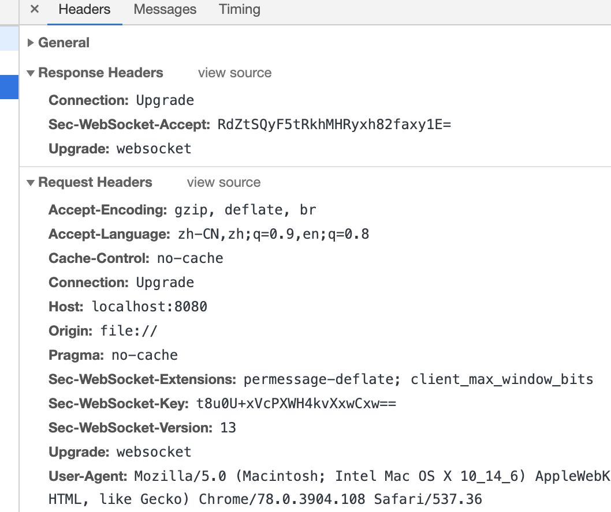

# websocket

特点：

- 全双工
- 属于应用层
- 基于 TCP 传输数据，使用 HTTP 完成握手
- 有状态

优点（相较于 HTTP）：

- 支持全双工通信
- 报头更小
- 更好的二进制支持
- 无同源策略限制

# 建立连接

HTTP 请求头：

```http
GET ws://localhost:8080/ HTTP/1.1
Host: localhost:8080
Connection: Upgrade
Pragma: no-cache
Cache-Control: no-cache
User-Agent: Mozilla/5.0 (Macintosh; Intel Mac OS X 10_14_6) AppleWebKit/537.36 (KHTML, like Gecko) Chrome/78.0.3904.108 Safari/537.36
Upgrade: websocket
Origin: file://
Sec-WebSocket-Version: 13
Accept-Encoding: gzip, deflate, br
Accept-Language: zh-CN,zh;q=0.9,en;q=0.8
Sec-WebSocket-Key: t8u0U+xVcPXWH4kvXxwCxw==
Sec-WebSocket-Extensions: permessage-deflate; client_max_window_bits
```

响应：

```http
HTTP/1.1 101 Switching Protocols
Upgrade: websocket
Connection: Upgrade
Sec-WebSocket-Accept: RdZtSQyF5tRkhMHRyxh82faxy1E=
```

websocket 先通过 HTTP 请求与 server 协商升级协议，协议升级完成后使用 websocket，根据具体的字段表现为：

```http
Connection: Upgrade  表示要升级协议，升级后的协议为Upgrade字段

Upgrade: websocket   升级为websocket

Sec-WebSocket-Version: 13  websocket版本为13，如果server不支持，同样需要返回相同的字段，内容是server支持的websocket版本

Sec-WebSocket-Key: t8u0U+xVcPXWH4kvXxwCxw==   这个字段和server返回的Sec-WebSocket-Accept相对应，提供最基本的防护

Sec-WebSocket-Extensions: permessage-deflate; client_max_window_bits
```

## Sec-WebSocket-Version

如果客户端发送的这个字段的值，server 支持则直接建立连接，否则 server 返回其所支持的所有版本。客户端如果支持其中任意一个，就会再次使用 server 支持的那个版本再次进行握手请求。

> 客户端的版本不一定要是最新的，只要 server 收到消息是有效的并且 server 支持这个版本就接受是这个版本。

## Sec-WebSocket-Key

向 server 提供所需信息，以确认 client 有权请求升级到 WebSocket。这个头部可以一定程度上保护以防止滥用。有助于防止非 WebSocket 客户端无意或滥用请求 WebSocket 连接。简单理解就是确认当前请求要升级到 WebSocket。

> 这个头部由对应的客户端自动添加，在浏览器不能使用 xhr.setRequestHeader 来手动添加。

## Sec-WebSocket-Accept

当 server 同意升级时，会在响应中包含这个头部，它的值是根据请求头中的 `Sec-WebSocket-Key` 值与 `258EAFA5-E914-47DA-95CA-C5AB0DC85B11` 连接后取 SHA-1 的哈希，然后对结果进行 base64 编码。



```js
const crypto = require('crypto');
const magic = '258EAFA5-E914-47DA-95CA-C5AB0DC85B11';
const secWebSocketKey = 't8u0U+xVcPXWH4kvXxwCxw==';

const secWebSocketAccept = crypto
  .createHash('sha1')
  .update(secWebSocketKey + magic)
  .digest('base64');

console.log(secWebSocketAccept === 'RdZtSQyF5tRkhMHRyxh82faxy1E=');
```

## Sec-WebSocket-Protocol

指定一个或多个 WebSocket 协议，也是按照优先级排序以逗号分隔。server 选择第一个支持的协议，并且在 Sec-WebSocket-protocol 响应中返回这个协议。

> 如果客户端没有发送这个头，服务器也就不用发了。

## Sec-WebSocket-Extensions

指定一个或多个协议级 WebSocket 扩展，要求 server 使用。

# 数据帧

WebSocket 中数据都是通过数据帧来传输的，为了避免 proxy 或者一些其他安全原因，客户端必须在所有的帧中添加掩码（服务器则不需要）。服务器收到没有添加掩码的数据帧后必须立即关闭连接，同样的客户端收到了添加掩码的数据帧也要关闭连接。

# 参考

https://cloud.tencent.com/developer/article/1005550
