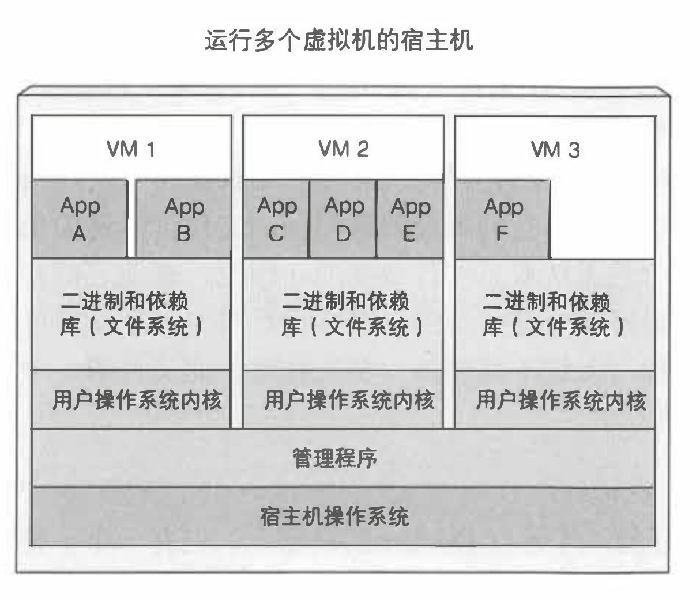

容器
# linux container vs VM
container相比于VM更加轻量。能够在相同的硬件资源下运行更懂的组件。

> 因为VM需要额外的系统进程，这就造成了除业务组件所需资源以外的开销。而container本质上就是运行在同一个系统下的进程而已。

当然，VM的优点则是为运行在其之上的业务组件和运行在其他VM上的业务组件提供完全隔离的环境。

# container 隔离机制
## linux namespace
linux 最初会拥有一个namespace，所有的系统资源都属于这个namespace, 文件系统
网络接口、用户id等。

对于一个进程，只能够看到同一个namespace下的系统资源。一个进程可以隶属多个namespace。

存在以下类型的namespace：
+ Mount (mnt)
+ Process ID (pid)
+ Network (net)
+ Inter-process communicaion  (ipd)
+ UTS
+ User ID (user)
> 让2个进程运行在2个不同namespace的Network，那它们各自就只能看到它自己的那组网络接口

## linux cgroups
限制container能够使用的系统资源。（通过cgroups实现，cgroups是linux的内核功能，被用来限制一个/组进程的资源使用）

一个进程的资源(CPU、内存、 网络带宽等）使用量不能超出被分配的量。 这种方式下， 进程不能过分使用为其他进程保留的资源。

# docker container vs VM
docker container 通常是 linux container。

前面提到，每个container是隔离的，那它们是如何共享一些相同的系统资源的呢？（VM自不必说，因为它们直接拥有相同的OS也就有了相同的FS）

不同的docker image 可能有着相同的父镜像，不同的image可以使用它们相同的父镜像来作为基础镜像。两个不同的image可以读取相同的基础镜像的文件，这样就能够共享相同文件了（其他的资源也是类似的吧？）

当然，这仅仅针对 read 操作，如果 container 要对文件进行 write 操作呢？依然是隔离的，因为container镜像层是只读的，container运行时，在镜像层之上会创建一层新的可写镜像层，当某个container要进行write操作时，实际上会在可写镜像层上创建一个copy，container写入的正是这个copy。

