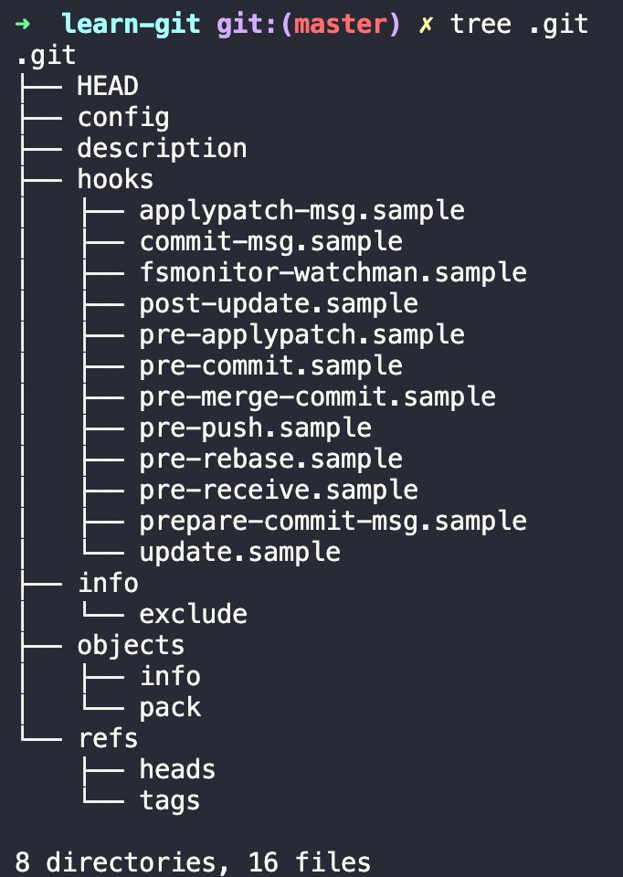
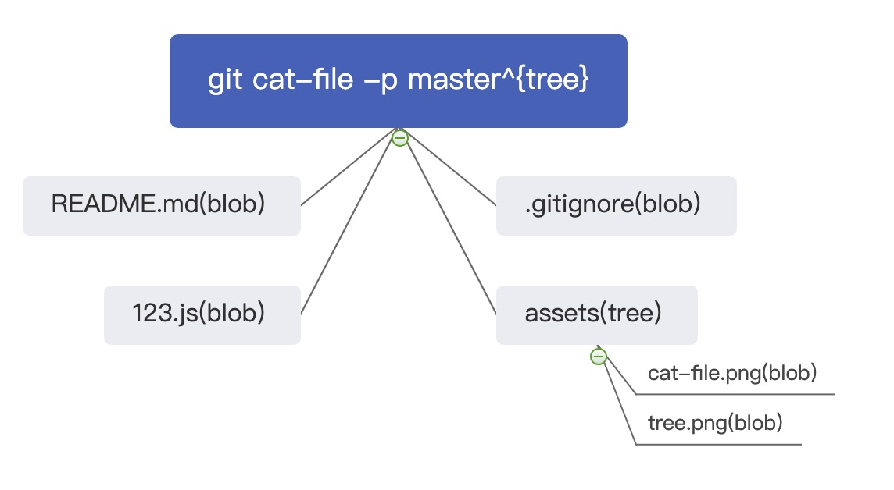

`git` 是一个内容寻址文件系统，也就是说 `git` 的核心是一个 key-value data store.

# .git
`git init` 后：



+ config 文件包含项目特有的配置选项
+ description 供 GitWeb 使用，无需关心
+ hooks 目录包含客户端或服务端的 `hook scripts`
+ info 目录包含一个全局性排除（global exclude）文件， 用以放置那些不希望被记录在 `.gitignore` 文件中的 ignored patterns

其他的都是 git 核心组成部分：
+ HEAD 指向目前被检出的分支
+ objects 存储所有的数据内容
+ refs 存储指向数据（分支、远程仓库和标签等）的提交对象的指针
+ index 保存暂存区信息(git add)

# git objects
`git` 是一个 key-value data stroe，所有每个资源都会有唯一的key， `git` 就是通过这个唯一的key来拿到其对应的value的。

## 将数据存储到 git store 中
`git hash-object -w $FILE_PATH` 会返回一个长度为40的 `SHA-1` hash ，这个 hash 是将待存储的数据外加一个头部信息（header）一起做 `SHA-1` 校验运算而得的校验和。 

>前两个字母作为 `.git/objects/` 下的目录名，其余作为此目录下的文件名。

## 从 git store 中取出数据
```sh
# 获取文件类型，一般是blob
git cat-file -t 8e3b44475aea7909faffaff218488b048f71b776
# 获取文件的内容
git cat-file -p 8e3b44475aea7909faffaff218488b048f71b776
```

## 对文件进行版本控制
每次对某个文件进行 `git add` 都会根据文件的内容和一个头部信息做 `SHA-1` 校验和，然后以此作为 key 存储至 git store 中。所以即使是同一个文件，只要每次 `git add` 的时候内容发生改变，那每次 `git add` 的文件内容都会被存储在 `.git/objects/` 中，在需要回退的时候只需要根据 key 去到对应的 value 即可实现对文件的版本控制了。

```sh
find .git/objects -type f | xargs ls -lt | sed 60q #显示最近60次 add
git cat-file -p ID
```
> 当初我 `git add` 完没 `git commit` 导致代码丢失，皮哥就是用这个指令来帮助我找回的。

## tree object
一个树对象（和unix中的inodes类似）包含了一条或多条树对象记录（tree entry），每条记录含有一个指向数据对象或者子树对象的 SHA-1 指针，以及相应的模式、类型、文件名信息.

树对象能解决文件名保存的问题，也允许我们将多个文件组织到一起。
```sh
➜  git cat-file -p master^{tree}     
100644 blob b512c09d476623ff4bf8d0d63c29b784925dbdf8    .gitignore
100644 blob e69de29bb2d1d6434b8b29ae775ad8c2e48c5391    123.js
100644 blob 8e3b44475aea7909faffaff218488b048f71b776    README.md
040000 tree b4ca1f07123a4b59e72a40ef9487343a4520f3e0    assets
```
其中 assets 是个文件夹，所以类型就是 tree 了，也就是说它不是一个数据对象，而是一个指针，指向另一个树对象。
```sh
➜  git cat-file -p b4ca1f07123a4b59e72a40ef9487343a4520f3e0
100644 blob c2ab50ce068811a0dfa0c2db1e3ea8a6c68951eb    cat-file.png
100644 blob 040127493f73de7afe19079793d148730f7bc08d    tree.png
```


