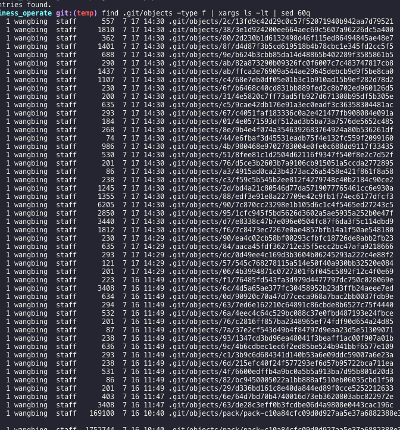

# git add .之后的补救
```sh
find .git/objects -type f | xargs ls -lt | sed 60q #显示最近60次 add
git cat-file -p ID > filename #(ID 就是add的ID)
```

对应`add`的`id`就是：


objects/之后的就是id，不过要把/去掉，比如objects/2c/2342534j, 那对应的id就是：`2c2342534j`。

> 有了它，妈妈再也不用担心的`git add`后的文件会丢啦。