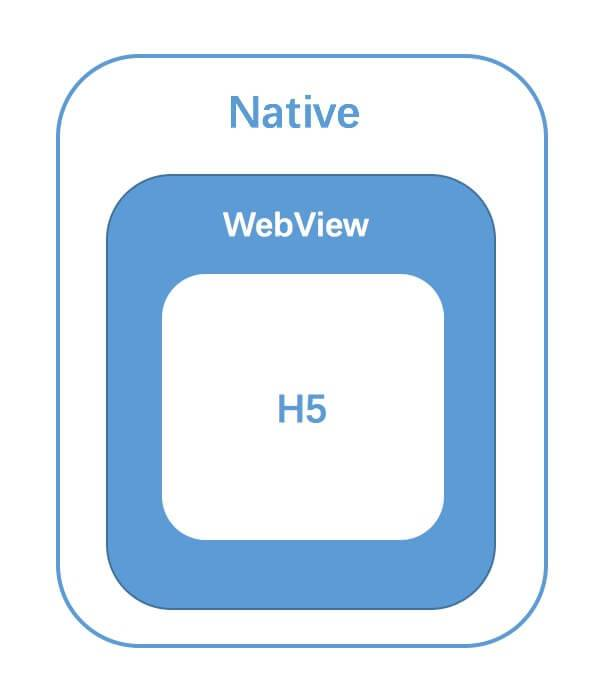
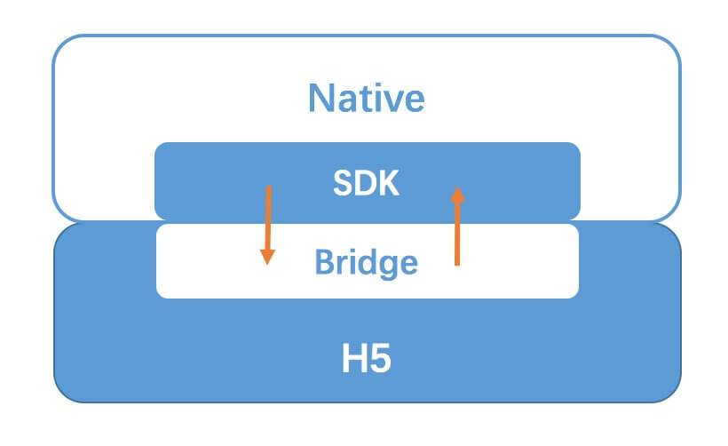

# 现有混合方案
比较流行的混合方案有三种，主要是在UI渲染机制上的不同：
+ WebView UI：通过 `JSBridge` 完成 `H5` 与 `Native` 的双向通信
+ Native UI：`Weex、RN` 等。给予 `js` 原生 `API` 的基础上，通过 `JSBridge` 将js解析成的 `VNode` 传递到 `Native` ，并且使用原生的 `View` 组件进行渲染
+ 小程序：通过更加定制化的 `JSBridge` ，使用双 `WebView` 双线程的模式隔离了 `JS` 的逻辑和 `UI` 的渲染。

他们都是通过 `JSbridge` 完成通信，后两种是在第一种的基础之上，通过使用原生的视图进行渲染进一步提高应用的混合程度。 `JSBridge` 是整个hybrid应用的关键部分，微信使用JS-SDK，wx对象就是 `JSBridge` 。

# 优点
+ web技术开发灵活，布局写起来非常快速（较 `Native` 而言）
+ 线上热更新： `Native` 更新是需要发布到 `app store` ，审批通过之后才能够被下载更新。而 `web` 页面直接通过 `http` 下载少量资源文件，更新只需要替换掉 `server` 上对应的文件即可实现更新效果

# 原理
`hybrid`本质就是用`WebView`组件内嵌一个web页面。所以最核心的点就是web页面与Native之间的通信。这种通信方案就是**JSBridge**。

## js通知Native
+ API 注入： `Native`获取js的context，直接在上面挂载方法，js直接调用即可。Android和iOS有对应的挂载方式
+ WebView对`alert、prompt、conosle`的拦截，因为`alert、console`的使用频率较高，一般使用`prompt`以免冲突
+ WebView URL Scheme 跳转的拦截

二三种的原理都是通过WebView对js的一些行为的拦截，从而达到通信的目的。

# js通知Native

## WebView URL Scheme
### 实现原因
在WebView中发出的所有网络请求，`Native`的WebView都能捕获和监听得到。

### 协议的定制
我们可以发现在进行一些跳转的时候，协议并不是常用的http，而是一个下面这样的东西：
```js
const webURL = url
const targetURL = `sslocal://webview?url=${encodeURIComponent(webURL)}&other_key=other_value`
```
也就是自己定制了一套URL的协议。不同的协议代表了不同的含义，比如我们平时使用的 `http、file` 等，格式都是：
```
scheme://likehost/path?querystring
```
一些point：
+ 最好让定义的协议具有语义，比如整个公司通用的协议可以命名为：`somecompoany://`，某个 `app` 专用则可以是`someapp://`等等
+ 不要使用 `window.location.href` 去进行跳转，因为多个连接连续对 `href` 进行赋值的时候，只有最后一个生效，其余会被忽略。这样会导致 `Native` 忽略相关信息。常用的方式是通过动态创建 `iframe` ，赋值 `src` 来发送请求信息的。
+ 安全性的考虑，需要在client设置白名单或者限制，避免公司内部业务协议被第三方直接调用

### 协议的拦截
Native能够通过相关API实现WebView中发出请求的拦截操作：
+ iOS：`shouldStartLoadWithRequest`
+ Android： `shouldOverrideUrlLoading`

当解析到请求的URL是自定义协议的时候，就不是发起对资源的请求了，而是parse其params，进行相关的操作，完成实现规定好的映射。

### 协议的回调
因为实现双向通信的本质还是发送请求，这肯定是异步的过程，这里用到js事件系统中的  `window.addEventListener` 和 `window.dispatchEvent` 这两个APi：
+ 发送请求的时候，通过协议(作为唯一的标识)注册自定义事件，将`callback`绑定到对应的事件上
+ Native完成对应的操作之后，调用`Bridge`的`dispatch`直接携带data触发该协议的自定义事件

```js
window.addEventListener(`getNetwork_${id}`, callback)
Bridge.send(`scheme://getNetwork?id=${id}`)
```
Native获取到信息完成操作之后，通过bridge回传data
```js
const event = {
  data: 'some message'
}
window.dispatchEvent(event)
```
> 因为使用唯一标识id，所以一旦id重置的时候，为了避免重复绑定相同的事件，需要对之前的listener进行移除（`removeEventListener(`getNetwordk_${prevId}`)`）

### 参数传递
和浏览器一样，`WebView`对`URL`的长度也会有限制，所以和`get`请求有一样的问题，那就是传递数据的大小有限制。在使用`base64`或其他编码发送大量数据的时候有可能超出的部分被截断。

所以比较合理的做法是使用函数调用。也就是`Native`直接调用`js`的函数，并获取其返回值。

能够这么做的原因是：`Native`可以直接调用`js`的方法（通过相应的`API`），并且能够获得其返回值

这样就可以传递给`js`参数告诉`js`，`Native`想要什么，我直接`return`即可。

# Native通知js
因为Native就是js的宿主，所以有更底层的权限，所以这个方向的通信要简单的多。
```java
// 无法获取返回值
webView.loadUrl("javascript:JSBridge.trigger('NativeCall')")

mWebView.evaluateJavascript(
  "javascript:JSBridge.trigger('NativeCall')",
  @Override
  public void onReceiveValue(String value) {
    // value为返回结果
  }
)
```
当系统版本低于4.4的时候，`evaluateJavaScrip`t无法使用，而且上面的这个方法没办法得到返回值，所以需要使用`prompt`进行兼容处理，让H5通过`prompt`进行数据发送，Native进行拦截并获取数据即可。

# js中对Bridge的接入


+ js：在js注入`bridge`实现的代码（通过`prompt`、`iframe`等，拼装好`scheme`，js调用之用传递参数即可）
+ native：拦截URL请求，解析`scheme`，执行约定好的操作

一般情况不会让bridge这部分直接由前端来每次实现，是将两部分封装成SDK。由Native来引入，初始化WebView的时候，如果页面的地址在白名单内则直接在对应的HTML头部注入对应的bridge.js文件。

这么做有一下好处：
+ 双方代码统一维护，不会造成不一致性
+ App接入方便，只需要引入对应版本的SDK就能够直接运行整套的hybrid方案
+ h5不需要关注这些，就跟写普通的网页一模一样，只不过多了几个全局的API罢了

> 需要注意的是，h5不知道什么时候bridge.js文件加载好了，所以需要native在页面完成之后去通知h5即可。

# native对h5的接入
## 一、在线H5
H5将打包好的资源放到服务器上，`native`直接使用对应的`URL`放到`WebView`中即可。

好处：
+ 完全不影响`native`的大小，因为直接使用`online`资源
+ 完全的热更新，接入成本非常低
+ 独立性强，h5的变动完全的独立的，不会影响app

缺点：
+ 完全依赖网络，在`offline`的情况下，无法加载
+ 首屏依赖网络

> 这种方式更适合轻量的页面，也就是不需要复杂逻辑的地方，只是一些tip、help page等

## 二、内置h5
将h5打包好的资源下载到客户端，解压存储到本地。

优点：
+ 首屏更快不依赖网络
+ 可离线化

缺点：
+ 更新流程复杂，需要客户端、server等的协助
+ 增加app体积等

> 两种方案根据不同场景去选择，优点、缺点刚好是反着的（当然共有的就不说了）

# 总结
通过上面的学习，基本上弄清楚了js和`native`是如何通信的，也明白了公司那一堆`scheme://webview?`到底是干啥的了。

通信的本质就是模拟网络请求，`native`对网络请求的拦截，然后由`native`去调用只有`native`才能调用的api，完成之后通过回调方式再传回给h5。这样就实现了`hybrid`的开发。
