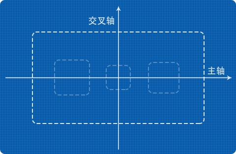
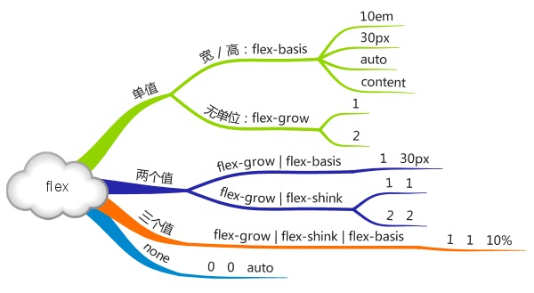
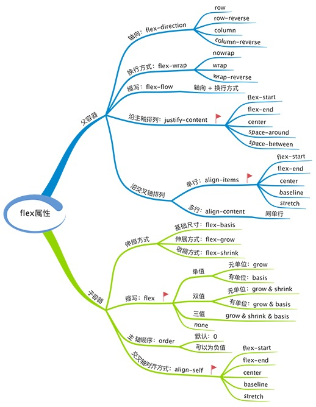

# flex

# 轴和容器
flex的主要概念其实就两个：轴和容器。

## 轴

+ 轴：
  + 主轴
  + 交叉轴

可以通过`flex-direction`来设置轴的方向：
+ row
+ row-reverse
+ column
+ column-reverse

## 容器
+ 父容器：统一设置子容器的排列方式
+ 子容器：单独设置自身排列方式
> 如果同时设置，以子容器为准

### 父容器设置排列方式
主轴：
+ justify-content:
  + flex-start
  + center
  + flex-end
  + space-between
  + space-around

交叉轴：
+ align-items:
  + flex-start
  + center
  + flex-end
  + stretch
  + baseline
  + normal

对于normal的行为，取决于**子容器**处于何种布局模式中：
+ absolute, fixed: 同flex-start
+ 其他: 同stretch

### 子容器设置排列方式
主轴：
+ flex:
  + flex-grow: 一个无单位的非负数字，默认为0，当所有子容器宽度之和小于父容器宽度时生效。它的计算方式为：`子容器宽度 = (父容器宽度-所有子容器flex-basis之和) * 子容器flex-grow所占比`.
  + flex-basis: 设置子容器在主轴上的初始宽度，同时设置width(height),flex-basis优先级更高。
  + flex-shrink: 和flex-grow类似，默认值为1，不过是在所有子容器宽度之和大于父容器宽度时生效。计算方式为: `子容器宽度 = 原子容器宽度 - 父容器减小的宽度 * 子容器flex-shrink所占比`. 也就是说对于3个原宽度为100px的item，flex-shrink分别为1,2,3，父容器每减少100px，三个item的宽度会分别减少：100*(1/6),100*(2/6),100*(3/6)

> 图中应该是 flex-shrink

交叉轴：
+ self-align: 取值同 align-items， 同时设置优先级更高。

# 进阶
换行flex-wrap:
+ wrap
+ wrap-reverse
+ nowrap(default)

轴与换行flex-flow(flex-direction, flex-wrap)

换行时，每行的子容器在交叉轴上的排列方式：align-content，取值同align-items,区别是前者只会在换行时起作用，其目标为每一行的所有子容器（单位是整个行），后者则只是在每一行内。简而言之就是前者作用与整个行，而后者作用与行内的每个子容器。

设置子容器排列顺序：order: number,可以是负数

# 总结

