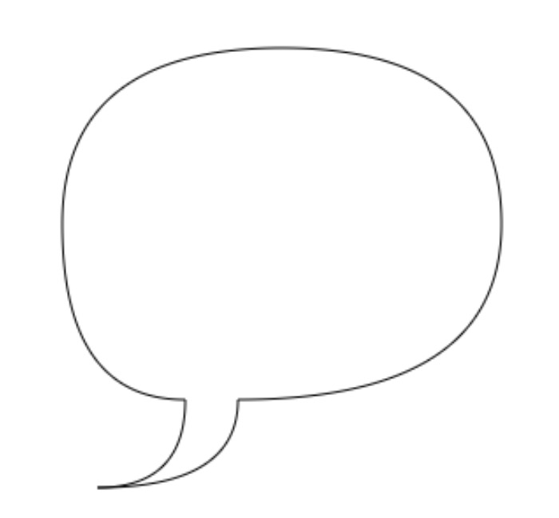
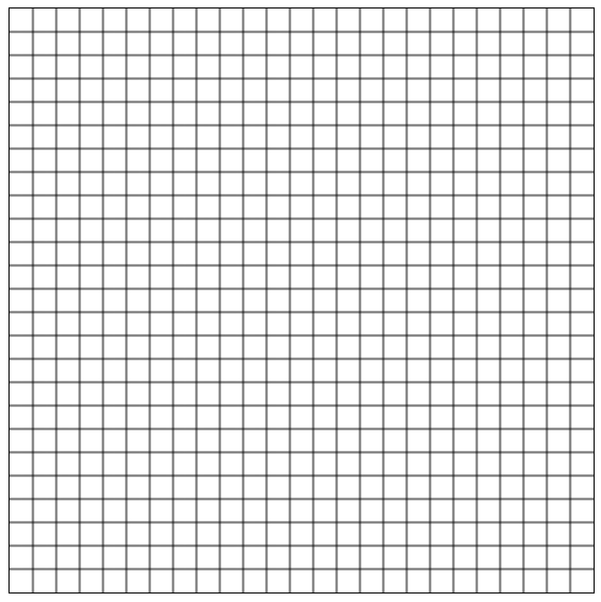
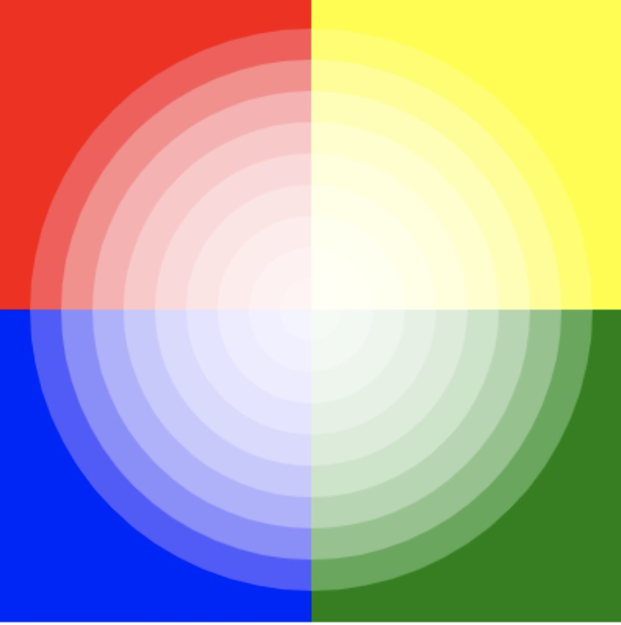

```tsx
const width = 500;
const height = 500;
const App = () => {
  const ref = useRef < HtmlCanvasElement > null;
  useEffect(() => {
    const canvas = ref.current!;
    const ctx = canvas.getContext('2d');
    // ↓
  }, []);

  return (
    <canvas
      key={key++}
      ref={ref}
      width={width}
      height={height}
      style={{ border: '1px solid' }}
    />
  );
};
```

- 二次绘制气泡：

```js
ctx.moveTo(100, 200);
ctx.quadraticCurveTo(100, 100, 225, 100);
ctx.quadraticCurveTo(350, 100, 350, 200);
ctx.quadraticCurveTo(350, 300, 200, 300);
ctx.quadraticCurveTo(200, 350, 120, 350);
ctx.quadraticCurveTo(170, 350, 170, 300);
ctx.quadraticCurveTo(100, 300, 100, 200);
ctx.stroke();
ctx.fill();
```



- 棋盘：

```js
const step = 20;
ctx.beginPath();
ctx.lineWidth = 1;
for (let i = step; i < width; i += step) {
  ctx.moveTo(i, 0);
  ctx.lineTo(i, width);
}

for (let j = step; j < height; j += step) {
  ctx.moveTo(0, j);
  ctx.lineTo(height, j);
}
ctx.stroke();
ctx.closePath();
```



- 渐变：

```js
ctx.beginPath();
ctx.fillStyle = 'red';
ctx.fillRect(0, 0, 200, 200);
ctx.fillStyle = 'yellow';
ctx.fillRect(200, 0, 200, 200);
ctx.fillStyle = 'blue';
ctx.fillRect(0, 200, 200, 200);
ctx.fillStyle = 'green';
ctx.fillRect(200, 200, 200, 200);
ctx.globalAlpha = 0.2;
for (let i = 0; i < 10; i++) {
  ctx.fillStyle = '#FFF';
  ctx.arc(200, 200, i * 20, 0, 2 * Math.PI);
  ctx.fill();
}
ctx.closePath();
```


