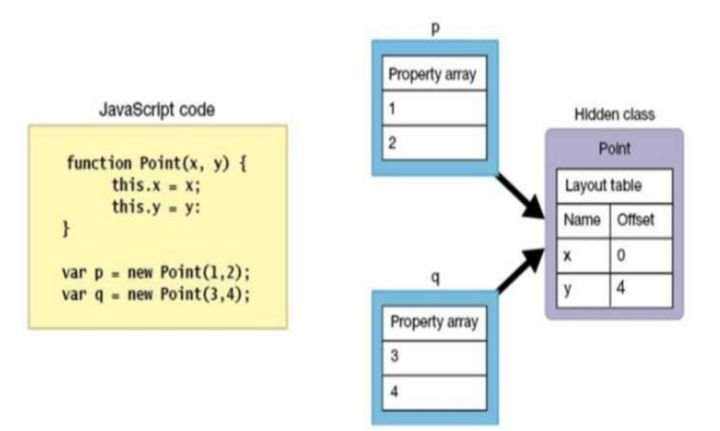

# 编译流程

`V8`会将`js`代码解析成抽象语法树，通过`ignition`遍历语法树生成响应的字节码，这些字节码会在执行过程中被`TurboFan`编译成本地机器代码。

# 预解析

`V8`肯定不会对整个脚本都进行解析，因为不是所有的脚本都需要立即执行的。`V8`将`js`分成两个部分： `Toplevel` 和 `Non Toplevel`。

```js
function fn1() {
  // toplevel
  console.log('fn1'); // none toplevel
}
function fn2() {
  // toplevel
  console.log('fn2'); // none toplevel
}
fn1(); // toplevel
const i = 520; // toplevel
```

也就是说，函数的头部属于顶级 `scope` ，内部不属于。在进行解析的过程中， `Non Toplevel`仅仅会被预解析（只进行语法检查，不会解析成抽象语法树，更不会被编译成字节码）。

而`toplevel`部分会被解析器完全解析，生成抽象语法树 => 遍历抽象语法树 => 生成字节码 => 生成本地代码。这部分编译器是不会对代码进行优化的， 唯一的任务就是应尽快得到可执行的字节码。

对于`none toplevel`的部分，只有等到在函数被调用的时候才会被编译成本地代码。如果此函数频繁执行，会被认定为热门代码，则会对这部分代码进行优化。

> 这种优化手段就减少了很多解析、编译函数的时间。整体运行的速度也会更快

# 函数优化

```js
function fn(num) {
  return num * num;
}
let i = 100000;
while (i--) {
  fn(i);
}
```

上面的例子，因为`fn`的执行次数很多，而且每次传入的参数类型都是相同的，所以会被认定为热门函数，进行有些优化。不过一旦函数被认定为是热门函数之后，一旦传入不同类型的参数，优化后的代码就不在适用了，会进行回滚，使用未优化的代码。

# 隐藏类型机制

因为 js 解释执行的特点，只能在 runtime 时确定变量的类型，所以修昂比于静态类型而言就不那么高效了.`V8`对这块的优化采用了动态创建**隐藏内部类**的方式,动态的将属性的内存地址记录在对象内,从而提升整体的属性访问速度.

每当某个对象新添了属性,`V8`会自动修正其隐藏内部类.隐藏类相同的对象可以共用相同的优化后的代码.


> 后面理解好像有点问题，回头改吧。。。

由于 JS 是一种动态类型的语言，当某个调用点接受一个参数时，需要进行一次动态查询来确定它的类型，进而确定一些偏移值等信息。如果在某个调用点一直是某种相同的类型参数，那么就可以将该类型的隐藏类和偏移值等信息缓存起来，下次再执行到该调用点时直接利用缓存的信息，不再执行任何查找。

# 单态、多态

上面说道了隐藏类型的机制，把某个类型、偏移值等进行缓存。

在函数执行之前，处于未初始化状态。当运行时调用这个函数的时候，它会进行一次动态查询，把其内部状态设置为“单态”。如果在后续调用过程中遇到了和当前类型不同的情况，需要重新改回“未初始化”。

如果一个特定的调用点经常遇到不同类型的对象，内敛缓存的优势会被状态频繁变更引起的开销所抵消，为了防止这种情况的发生。当某个特定调用点看到预定数量的不同类型时，会把类型修改成“复态”。

一旦进入“复态”，它后续的状态就不会再改变了，不再进行更多内敛缓存（`V8`定义的多态数目是 4），不再对代码进行优化了。

[V8 基础学习一：从编译流程学习 V8 优化机制](https://zhuanlan.zhihu.com/p/31828043)
