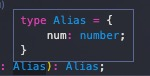
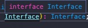

# type 可以 interface 不可

- type 可以实现类型重命名：

```ts
type AliasNumber = number;
```

- 联合类型：

```ts
interface Dog {
  woof();
}
interface Cat {
  miao();
}
type Animal = Dog & Cat;
const animal: Animal = {
  woof() {},
  miao() {},
};
type CatOrDog = Dog | Cat;
```

- 暂存某变量的类型：

```ts
const obj = { name: 'wbcs' };
type TVar = typeof obj;
// 等同于
type TVar = {
  name: string;
};
```

- 鼠标移到 alias 上会显示字面量，而 interface 则只是显示 interface 的名字：




# interface 可，type 不可

- 声明合并：

```ts
interface Person {
  age: number;
}
interface Person {
  name: string;
}
// Person 是
interface Person {
  age: number;
  name: string;
}
```
