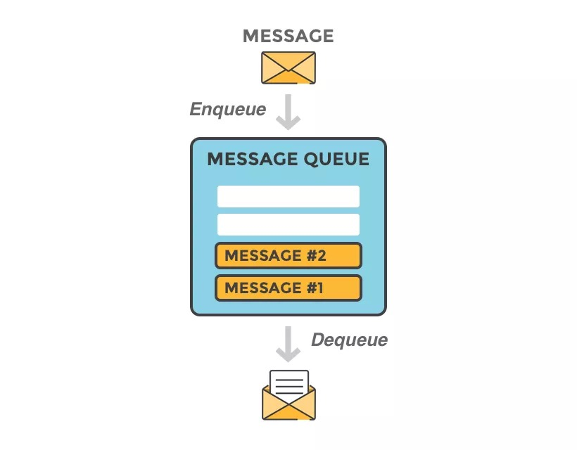
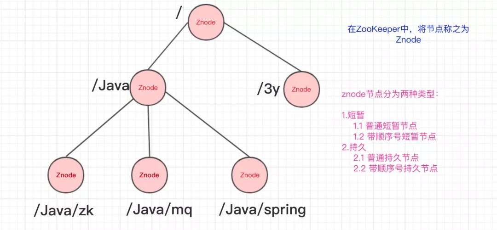
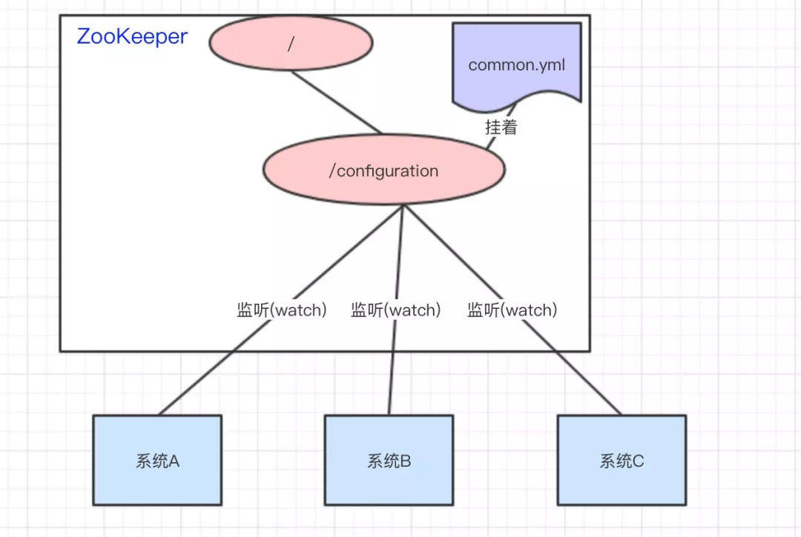
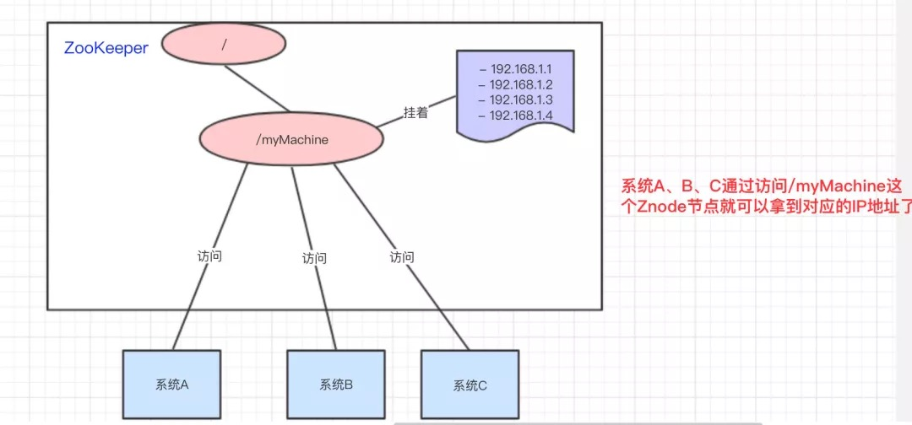
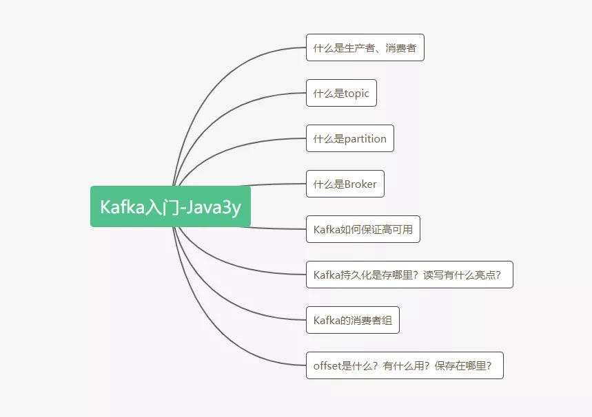
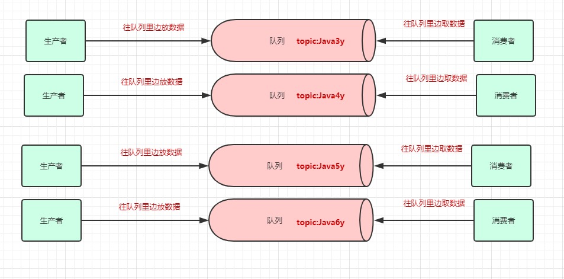
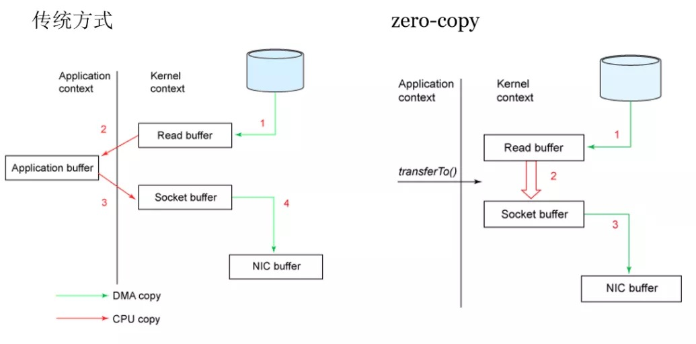

# 什么是消息队列 (Message Queue)?

`MQ` 可以理解为一种通信方式。把数据放入消息队列的一方被称为 生产者(`Producer`); 从消息队列中取出数据的一方被称为 消费者(`Consumer`)。

> 消息队列可以被用来实现进程、线程间的通信。

# 为什么需要消息队列？
+ 解耦: `Producer` 只需要将数据放入 `MQ` ，剩下的一概不关心
+ 异步: 一般 `Producer` 都是负责主任务的，在并发量巨大的情况下，过多的附属任务会影响到主任务会导致主任务迟迟不能返回。这个时候可以利用 `MQ` 实现对附属任务的异步调用，以此提高吞吐量。
+ 限流: 在请求数目超出服务器能力的时候，可以将请求写入 `MQ`，服务器端自发去读取 `MQ` 进行处理，能够实现限流防止服务器崩溃。

# `MQ` 面临什么问题？
+ 高可用: 为保证系统的稳定系、健壮性， `MQ` 肯定都是分布式/集群的，那 `MQ` 就必须要做到能够提供现成的支持，无需适用方手动实现
+ 数据丢失问题: 如果 `Producer` 写入数据到 `MQ` ， `Consumer` 来没来得及读取 `MQ` ，`MQ` 就挂掉 那其中的数据就会丢失。那 `MQ` 中的数据就不能只是存储在内存中，disk？redis？DB？分布式文件系统？sync or async？
+ `Consumer` 如何消费数据: `MQ` 主动推送数据(push)？ 消费方轮训(pull)？
+ 其他:
  + 数据重复问题？
  + 要保证数据的顺序怎么办？

# kafka
`kafa` 就是 `MQ` 的一种具体实现。

## Zookeeper
Zookeeper: A distributed coordination service for distributed applications. 也就是用于协调分布式应用的服务， `Zookeeper` 能够用来管理统一配置、集群管理、分布式锁、统一命名服务等。
> 因为要使用分布式就必然需要对各个节点进行管理(感知节点状态、对节点进行统一管理)， `Zookeeper` 就是作为能解决这些通用问题的 middleware

### 为什么 Zookeeper 能够实现对分布式应用的管理呢？
Zookeeper 的结构是一棵树，它的结点被称为 znode, znode 又分为两种：
+ 持久: 客户端和服务器断开连接后 znode 不会被删除
+ 短暂/临时: 客户端和服务器断开连接后 znode 会被自动删除

> 可以看出来 Zookeeper 和 redis、MySQL 等一样，都是 C/S 架构

知道了 Zookeeper 的数据结构是一棵树之后，还需要 **监听器**：
+ 监听znode的**个数**的变化
+ 监听znode的**数据**变化

#### 管理统一配置
和 webpack 的配置很类似，我们一般都会把相同的配置抽离出来，单独维护，这样当公共配置更改的时候就不需要修改多个配置了。

而且对于分布式应用，一旦配置更改就需要重启服务（就跟我们的配置改了需要重新 npm run dev），分离公共配置还能做到当某个特定的配置更改之后无需重启其他不相关的服务。

#### 集群管理
#### 统一命名服务

#### 分布式锁
@TODO

## kafka

前面已经说过 kafka 是一个消息队列的产品。

### topic & partition
一个 `QM middleware` 内部肯定不止一个 `Queue`， 所以 `Consumer` 要知道从哪个 `Queue` 中去读取数据； `Producer` 要知道把数据丢入哪个 `Queue`，就必须给每个 `Queue` 都取一个唯一标识符， 在 `Kafka` 中这个标识符被称作 **topic**。而为了提高一个 `topic` 的吞吐量，`Kafka` 还对 `topic` 进行了分区 (`partition`)。

### Broker
一台 `kafka` 服务器就是一个 `Broker`， `Kafka` 集群就是多个 `Broker`

`Producer` 会将数据扔到对应的 `topic` 中，但实际上数据会被分配到某个 `partition` 中，而一个 `partition` 又会被存储在多个 `Broker` 中。

> 由此可见，`Kafka` 是天然 分布式的。

除此之外，每个 `broker` 都会对每个 `partition` 进行备份(被称为备分区)，`Consumer`、`Producer` 和各个 `topic` 交互都是跟主分区进行交互，备分区只做备份不进行读写。只有当某个 `Broker` 挂掉时，其他的 `Broker` 会读写被备份在 disk 上的备份 `partition`，以此来确保数据不会丢失。
> `kafka` 也不是一有数据就直接将备份写入到磁盘，而是先缓存一部分然后 flush。其中写入磁盘的方式是 append，防止随机读写造成耗时问题。

生产者可以有多个，消费者也可以有多个。多个消费者可以组成一个消费者组。同属于一个消费者组的消费者可以同时消费一个 `topic` 中的不同 `partition` ，以此提高吞吐量。
+ 如果 `Consumer` 数量多于 `partition` ，那多出来的 `Consumer` 会被闲置
+ 如果某个 `Consumer` 挂掉，剩余的某个 `Consumer` 要消费两个 `partition`
+ 如果多加入一个消费者组，无论是新增的消费者组还是原本的消费者组，都能消费`topic`的全部数据。（消费者组之间从逻辑上它们是独立的）

`Consumer` 在读取数据的时候也和一般情况有所不同，一般情况下都需要将数据拷贝到内核态的数据拷贝到用户态，而 `Consumer` 则直接通过 sendfile() 直接从内核空间（DMA的）到内核空间（Socket的），少做了一步拷贝的操作。

### offset
上面讲到一旦某个 `Consumer` 挂掉，剩下的`Consumer` 要多消费一个 `partition` ，那新的 `Consumer` 是如何知道上一个 `Consumer` 消费到哪个位置了呢？

`kafka` 使用 `offset` 来存储消费者的进度，每个 `Consumer` 都有一个 `offset`。

## kafka 是如何解决 MQ 面临的那些问题的？
+ 高可用, 为保证系统的稳定系、健壮性， `MQ` 肯定都是分布式/集群的，那 `MQ` 就必须要做到能够提供现成的支持，无需适用方手动实现 
  `kafka` 是天然分布式，一个 `topic` 分为多个 `partition`，一个 `partition` 有被分布到不同的 broker
+ 数据丢失问题? 
  如果 `Producer` 写入数据到 `MQ` ， `Consumer` 来没来得及读取 `MQ` ，`MQ` 就挂掉 那其中的数据就会丢失。那 `MQ` 中的数据就不能只是存储在内存中，disk？redis？DB？分布式文件系统？sync or async？ 
通过消息日志的方式 append 到 disk 中，再通过 `offset` 确定读取的位置即可。写入会先缓存一部分，然后flush
+ `Consumer` 如何消费数据: `MQ` 主动推送数据(push)？ 消费方轮训(pull)？ 
  `Kafka` 中的消息消费是一个不断轮询的过程，也就是 pull
+ 数据重复问题？ 
  因为分布式系统无法避免网络抖动等问题，可能某个 `Consumer` 刚刚消费完某个数据，还没来得及更新 `offset` 就挂了，后续别的 `Consumer` 再根据原来的 `offset` 消费的时候就会造成数据重复问题。所以如果不允许出现数据重复，可以在应用中对数据进行判断。
+ 要保证数据的顺序怎么办？ 
  `Kafka` 会将数据写到 `partition` ，单个 `partition` 的写入是有顺序的。如果要保证全局有序，那只能写入一个 `partition` 中。如果要消费也有序，消费者也只能有一个。

# 总结
@TODO