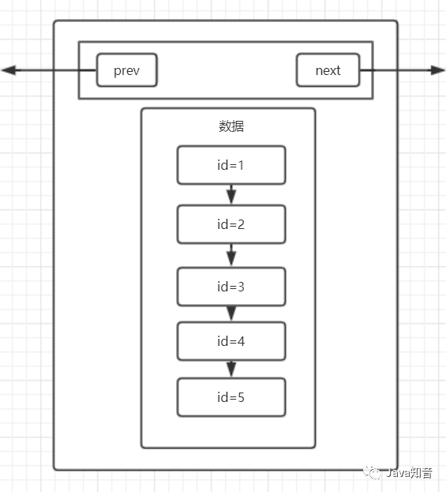
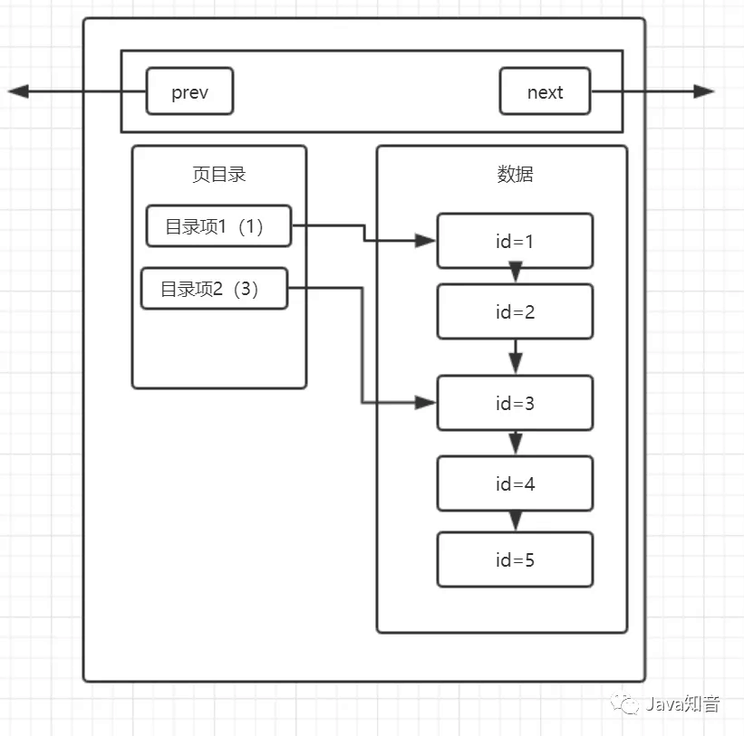

# 索引
```sql
CREATE [UNIQUE] INDEX `index_name`
ON `table_name` (column_name [, column_name2]);
```

## 页
数据都是存储在 `disk` 上的，而我们要对数据进行访问就必须要加载到 memory 中，前者的开销相比于后者高了不止一个数量级，所以为了提高效率要尽可能的避免过多的访问 `disk` ，于是 MySQL 就引入了 **页** 的概念。

通过把相邻的（这意味着数据必须是有序的） record 一起读入到 memory ，这保存多条 record 的数据结构就是页。页的引入能够减少访问 `disk` 的次数（根据程序的局部性原则）。 MySQL 的 `InnoDB` 引擎，页的大小是 *16kb* ，并且 MySQL 的数据也是以页为基本单位.



## 页目录
即使使用 页 这种模式，本质上依然是 O(n) 只是减少了访问disk的次数而已，当数据量足够大的时候效率肯定还是不够的。所以又引入了 **页目录**。



页目录中的目录项会存放这个目录项中最小的id，如果一页有m个目录的话，那对于每一页来说时间复杂度就降低为 `O(n/m)`。 MySQL 一页最多有16kb，当存在多页时， MySQL 又引入了 **目录页**。

@TODO。


## 聚簇索引和非聚簇索引
**聚簇索引**就是把索引和数据放在一起，找到索引就找到数据了；反之**非聚簇索引**就是将数据和索引分开，查找时先查找到索引，然后通过索引找到对应的数据。
> `InnoDB` 有且只有一个聚簇索引， `MyISAM` 则都是非聚簇索引。ps: 之所以很少使用聚簇索引，是因为聚簇索引把索引和数据放在一起，这样每次新建一个 index 就会保存一份数据，这样会造成数据的冗余，消耗资源。

## 其他
1. 创建了索引，也满足条件但是并不意味着查询一定会通过索引查询。因为还存在优化选择器，MySQL会找出SQL所有的可行方案，然后计算各自的成本最终执行成本最低的方案：
  - 根据搜索条件找出所有可行的索引
  - 计算全表扫描开销
  - 计算各个索引开销
  - 对比，选开销最小的

2. 非聚簇索引不一定都要回表查询：
  - SQL查询的信息只从索引中就能获取时，不需要回表
  ```sql
    CREATE INDEX index_bitchs ON bitchs (name, age);
    
    -- 这个SQL就不会回表
    SELECT name FROM bitch WHERE age=18;
  ```

## 总结
学习索引，可以发现使用了很多计算机公共基础知识：分页、B+树、局部性原则等等。

- 排序：插入排序的目的是优化查询笑了
- 页：减少IO
- 页目录：避免查询遍历整个List
- 多页：数据量过大时，开辟新的页来保存数据
- 目录页：保存各个页的 上限、下限以及页的地址，可以快速定位到数据所在的页

> 学会了索引，妈妈再也不用担心我查找只会遍历了😆